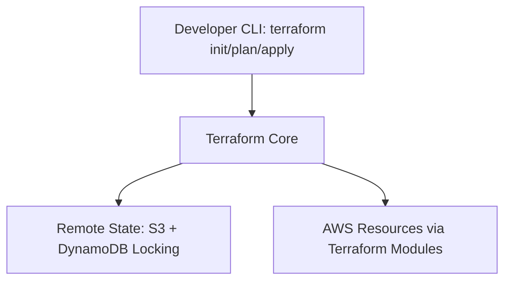
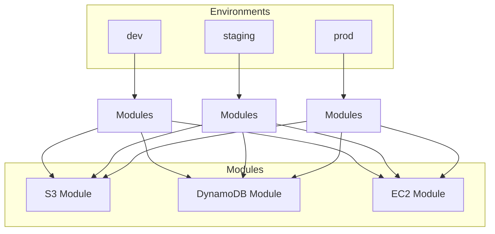

# Terraform Multi-Environment AWS Infrastructure

This repository contains a **Terraform** configuration for deploying AWS infrastructure across multiple environments (**dev**, **staging**, **prod**) using reusable modules.

The setup provisions:
- **S3 bucket** (per environment)
- **DynamoDB table** (per environment)
- **EC2 instances** (configurable per environment)
- Remote state management with **S3** and **DynamoDB** (for state locking)

---

## 📂 Project Structure:

```bash
terraform-multi-env/
│
├── modules/
│   ├── s3/
│   │   ├── main.tf
│   │   ├── variables.tf
│   │   ├── outputs.tf
│   │
│   ├── db/
│   │   ├── main.tf
│   │   ├── variables.tf
│   │   ├── outputs.tf
│   │
│   ├── ec2/
│       ├── main.tf
│       ├── variables.tf
│       ├── outputs.tf
│
├── envs/
│   ├── dev/
│   │   ├── main.tf
│   │   ├── variables.tf
│   │   ├── terraform.tfvars
│   │   ├── backend.tf
│   │
│   ├── staging/
│   │   ├── main.tf
│   │   ├── variables.tf
│   │   ├── terraform.tfvars
│   │   ├── backend.tf
│   │
│   ├── prod/
│       ├── main.tf
│       ├── variables.tf
│       ├── terraform.tfvars
│       ├── backend.tf
│
├── .gitignore
├── README.md
└── versions.tf
```

## 🛠 Prerequisites

- [Terraform >= 1.3.0](https://developer.hashicorp.com/terraform/downloads)
- AWS CLI installed and configured:
```bash
  aws configure 
```
S3 bucket & DynamoDB table for remote state backend

🗄 Remote Backend Setup (One-Time)
Before deploying, create an S3 bucket for storing Terraform state and a DynamoDB table for state locking.

Example commands:

```bash
aws s3api create-bucket --bucket my-terraform-state-bucket --region us-east-1
aws dynamodb create-table \
  --table-name terraform-locks \
  --attribute-definitions AttributeName=LockID,AttributeType=S \
  --key-schema AttributeName=LockID,KeyType=HASH \
  --billing-mode PAY_PER_REQUEST
  ```

Update backend.tf in each environment folder:

```bash
bucket         = "my-terraform-state-bucket"
key            = "<environment>/terraform.tfstate"
region         = "us-east-1"
dynamodb_table = "terraform-locks"
encrypt        = true
```

🚀 Deploying Environments
Each environment (dev, staging, prod) has its own backend.tf, variables.tf, and terraform.tfvars.

1️⃣ Deploy Development
```bash
cd envs/dev
terraform init
terraform plan
terraform apply
```
2️⃣ Deploy Staging
```bash
cd envs/staging
terraform init
terraform plan
terraform apply
```
3️⃣ Deploy Production
```bash
cd envs/prod
terraform init
terraform plan
terraform apply
```
## ⚙ Default Environment Settings

| Environment | S3 Bucket Name        | EC2 Count | EC2 Type   | DynamoDB Table Name           |
|-------------|-----------------------|-----------|------------|--------------------------------|
| dev         | myapp-dev-bucket      | 1         | t3.micro   | dev-tws-demo-app-table         |
| staging     | myapp-staging-bucket  | 2         | t3.small   | staging-tws-demo-app-table     |
| prod        | myapp-prod-bucket     | 3         | t3.medium  | prod-tws-demo-app-table        |

## 📦 Modules Overview

### **S3 Module** (`modules/s3`)
- Creates a **private, versioned S3 bucket**
- Blocks all **public access**
- Applies **tags** from the `tags` variable

### **DB Module** (`modules/db`)
- Creates a **DynamoDB table**
- **Primary key:** `userID`
- **Billing mode:** `PAY_PER_REQUEST`
- Uses **environment-specific naming** for table names

### **EC2 Module** (`modules/ec2`)
- Provisions **multiple EC2 instances**
- Runs **Amazon Linux 2 AMI**
- Configurable **instance type** and **volume size**
- Tags applied for each environment


🔄 Updating Infrastructure
To make changes:

Edit module code or environment config

Run:

```bash
terraform plan
terraform apply
```

🧹 Destroying an Environment
To remove resources for a specific environment:

```bash
cd envs/dev   # or staging/prod
terraform destroy
```

## 📝 Notes

- **State isolation** – Each environment stores its own remote state file in **S3**, ensuring no overlap between environments.  
- **Locking** – **DynamoDB** is used to prevent concurrent Terraform operations that could cause state corruption.  
- **Naming** – All resource names include the environment name for clarity and separation.  
- **Secrets** – Never commit sensitive values to the repository.  
  - Store them in `.tfvars` files (excluded via `.gitignore`)  
  - Or manage them securely using **AWS Secrets Manager**

---

1. **Tool/Flow Diagram** → showing Terraform, remote state (S3 + DynamoDB), and AWS resource creation.
2. **Component/Module Diagram** → showing how environments (dev, staging, prod) use modules (s3, db, ec2).

---

## 1️⃣ Terraform Flow Diagram (Tools + Remote State)

```text
                 ┌───────────────────────────┐
                 │       Developer CLI       │
                 │ terraform init/plan/apply │
                 └─────────────┬─────────────┘
                               │
                               ▼
                   ┌─────────────────────┐
                   │   Terraform Core    │
                   └─────────┬──────────┘
                             │
          ┌──────────────────┴───────────────────┐
          │                                      │
          ▼                                      ▼
┌─────────────────────┐              ┌─────────────────────┐
│  Remote State Store │              │   AWS Resources     │
│  (S3 bucket +       │              │  (Provisioned via   │
│   DynamoDB locking) │              │   Terraform modules)│
└─────────────────────┘              └─────────────────────┘
```

---

## 2️⃣ Component Diagram (Environments → Modules → Resources)

```text
                 ┌─────────────────────────────┐
                 │        Environments         │
                 │   (envs/dev, staging, prod) │
                 └───────────────┬─────────────┘
                                 │
                ┌────────────────┼────────────────┐
                │                │                │
                ▼                ▼                ▼
         ┌───────────┐    ┌───────────┐    ┌───────────┐
         │    dev    │    │  staging  │    │   prod    │
         └─────┬─────┘    └─────┬─────┘    └─────┬─────┘
               │                │                │
               ▼                ▼                ▼
       ┌─────────────┐   ┌─────────────┐   ┌─────────────┐
       │   Modules    │   │   Modules    │   │   Modules    │
       │ (re-usable)  │   │ (re-usable)  │   │ (re-usable)  │
       └───┬─────┬────┘   └───┬─────┬────┘   └───┬─────┬────┘
           │     │            │     │            │     │
     ┌─────▼─┐ ┌─▼─────┐ ┌────▼─┐ ┌─▼─────┐ ┌────▼─┐ ┌─▼─────┐
     │  S3   │ │  DB   │ │  S3  │ │  DB   │ │  S3  │ │  DB   │
     └───────┘ └───────┘ └──────┘ └───────┘ └──────┘ └───────┘
         │         │         │        │         │        │
         ▼         ▼         ▼        ▼         ▼        ▼
     ┌──────────────────────────────────────────────────────────┐
     │                       EC2 Instances                      │
     │ (Count & type vary per environment: dev=1, stag=2, prod=3)│
     └──────────────────────────────────────────────────────────┘
```


---

### Terraform Flow



---

### Environment & Module Structure



---


# Acknowledgements
This project was created by taking reference and inspiration from Terraform with Shubham.
Check out Terraform with Shubham on YouTube for great Terraform tutorials.

